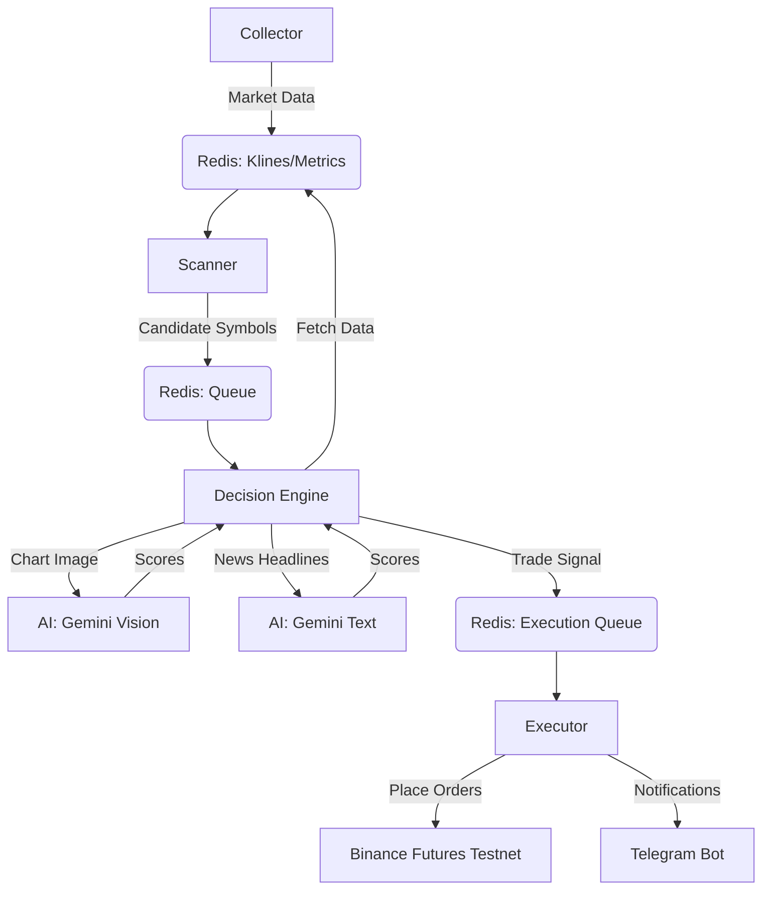

# Exhaustion Short Trading Bot

A fully automated, AI-powered crypto trading bot designed to catch overextended pumps on Binance Futures. It uses a multi-stage pipeline to identify, analyze, and execute high-probability short setups.

## 🔄 System Workflow

The bot operates as a distributed system with decoupled modules communicating via **Redis**.



## 🧩 Component Breakdown

### 1. Collector (`collector/`)
- **Role**: The "Eyes" of the bot.
- **Action**: Continuously fetches **Price Candles (OHLCV)**, **Funding Rates**, and **Open Interest** from Binance Futures.
- **Tech**: Uses `aiohttp` for raw, high-performance API requests. Stores data in Redis (hot storage) and SQLite (historical persistence).

### 2. Scanner (`scanner/`)
- **Role**: The "Filter".
- **Action**: Scans the market data for anomalies:
    - **Pump**: Price up 10-25% (4H) and 8-15% (1H).
    - **Volume**: Spikes ≥3x average.
    - **Sentiment**: Positive Funding Rates & Rising Open Interest (Trapped Longs).
- **Output**: Pushes potential candidates to the `scanner:candidates` queue.

### 3. AI Modules (`ai/`)
- **Role**: The "Analyst".
- **Pattern Recognition**: Generates a chart image (1H & 15m) and uses **Gemini 1.5 Flash (Vision)** to identify "blow-off top" or "bearish engulfing" patterns.
- **News Analysis**: Fetches top news headlines and uses **Gemini 1.5 Flash (Text)** to determine if the pump is news-driven (risky) or technical (good for shorting).

### 4. Decision Engine (`engine/`)
- **Role**: The "Brain".
- **Action**: Aggregates Scanner filters + AI Pattern Score + AI News Score.
- **Logic**: Calculates a final confidence score. If > 0.75, generates a trade plan with:
    - **Entry**: Market Short.
    - **Stop Loss**: 1.5% above recent highs.
    - **Take Profit**: 2% (TP1) and 8% (TP2) drops.

### 5. Execution Engine (`execution/`)
- **Role**: The "Hands".
- **Action**: Reads trade signals and executes orders on **Binance Futures Testnet** via Raw HTTP requests (Market Entry + Protected Orders).
- **Safety**: manages connection stability and reports actions to Telegram.

## 🚀 Usage

### Dependencies
```bash
pip install -r requirements.txt
```

### Configuration
1. Copy `.env.template` to `.env`.
2. Fill in `BINANCE_API_KEY`, `BINANCE_SECRET_KEY` (Testnet), `GENAI_KEY` (Google), and `TELEGRAM_BOT_TOKEN`.

### Running the Bot
Run the main orchestrator:
```bash
python3 main.py
```
*This starts all modules in parallel processes.*

### Utilities
- **Close All Positions**: `python3 close_all_positions.py`
- **Manual Test Trade**: `python3 force_test_trade.py` (if available)

## 📺 Where to Watch (Testnet)
To see the **same charts** the bot is seeing, you must use the Binance Testnet Interface:
👉 [**https://testnet.binancefuture.com/en/futures/BTCUSDT**](https://testnet.binancefuture.com/en/futures/BTCUSDT)

*Note: Do NOT use the "Demo Trading" on the main Binance app. That is a different simulation.*

## ⚠️ Risk Warning
This bot is configured for **Binance Testnet** by default. Use at your own risk. Always verify logic before deploying real capital.
